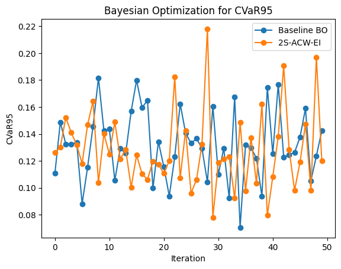

# Bayesian Optimization for CVaR-based Portfolio Optimization

## Overview

This repository contains experiment that implements Bayesian Optimization (BO) techniques for Conditional Value-at-Risk (CVaR)-based portfolio optimization, inspired by the research paper "Bayesian Optimization for CVaR-based portfolio optimization" by Robert Millar and Jinglai Li ([arXiv:2503.17737]('https://www.arxiv.org/abs/2503.17737'), Accepted by GECCO 2025).
The ipynb focuses on replicating and experimenting with the paper's proposed methods, including a baseline BO and the advanced **2S-ACW-EI (Two-Stage Active Constraint Weighted Expected Improvement)** algorithm. It uses real-world financial data from Indonesian stocks and Bitcoin to simulate portfolio allocation under risk constraints.

---

## Dataset

The dataset includes historical closing prices (last 485 trading days) for the following assets:

**BBCA.JK** – Bank Central Asia

**BBRI.JK** – Bank Rakyat Indonesia

**TPIA.JK** – Chandra Asri Petrochemical

**DSSA.JK** – Dian Swastatika Sentosa

**SMRA.JK** – Summarecon Agung

**DMAS.JK** – Puradelta Lestari

**BBNI.JK** – Bank Negara Indonesia

**SSIA.JK** – Surya Semesta Internusa

**PTRO.JK** – Petrosea

**BTC-USD** – Bitcoin

Data is sourced from Yahoo Finance using the `yfinance` library.


## Dependencies
To run the notebook, you'll need Python 3.x (tested on 3.11.7) and the following libraries. Install them via pip if not already available:

- `numpy` (>=1.26.0): For numerical computations and random number generation.
- `pandas` (>=2.2.0): For data handling and manipulation.
- `scikit-learn` (>=1.5.0): For Gaussian Process Regression and kernels (Matern, ConstantKernel, WhiteKernel).
- `scipy` (>=1.14.0): For statistical functions (norm), optimization (minimize), and more.
- `matplotlib` (>=3.9.0): For plotting results.
- `yfinance` (>=0.2.40): For downloading historical stock data from Yahoo Finance.

You can install the required packages with:
Install with:
```bash
pip install numpy pandas scipy scikit-learn matplotlib yfinance
```

## How to Run

1. Clone this repository or download the notebook.

2. Open `experimentation.ipynb` in Jupyter.

3. Run the cells sequentially. The notebook fetches live data from Yahoo Finance, so an internet connection is needed for the data loading section.

4. Adjust parameters in the "CONFIGURATION" section (e.g., ALPHA, R_MIN, N_ITER) to experiment with different settings.
5. The final plot visualizes CVaR minimization over iterations for both models.

Note: Data is fetched for the last 750 trading days ending July 31, 2025. Results may vary slightly due to real-time data updates or market changes post-August 26, 2025 (current date).


## Assumptions Made

- Data Source and Period: Historical adjusted closing prices are fetched via yfinance for 10 assets (9 Indonesian stocks from IDX with .JK suffix and Bitcoin as BTC-USD). Assumes 252 trading days per year for annualizing returns and covariance. Missing values are dropped, assuming no significant gaps in data.

- Return Simulation: Daily returns are annualized assuming normality and independence. Monte Carlo simulations use multivariate normal distributions based on empirical mean and covariance, with added small Gaussian noise (std=0.001) to mimic real-world uncertainty.

- Portfolio Constraints: Weights are non-negative, sum to ≤1 (allowing cash holdings). The feasible region is bounded, and the minimum expected return (R_MIN=0.09) is assumed active at the optimum.

- CVaR Estimation: CVaR at 95% confidence (ALPHA=0.95) is computed via Monte Carlo with 5,000 samples per iteration (for speed) and 100,000 for final evaluation (for precision). Assumes the return distribution is multivariate normal.

- Optimization: Gaussian Process uses Matern 5/2 kernel with hyperparameters optimized via scikit-learn defaults. Acquisition functions assume noise in evaluations. Random seed (42) ensures reproducibility.

- Asset Selection: Mix of large-cap, mid-cap, small-cap stocks, and Bitcoin to introduce varying risk/volatility levels. No transaction costs, taxes, or liquidity constraints are modeled.
- Computational Efficiency: The two-stage process assumes expected return evaluations are ~100x cheaper than CVaR, as per the paper.

These assumptions align with the paper's setup but simplify real-world factors like non-normal returns or market frictions for experimental purposes.

## Results and Insights

The notebook runs 50 initial random portfolios followed by 100 BO iterations (though the plot shows up to 50 for visualization). Key findings from a sample run:

Performance Comparison: Both the Baseline BO (blue line) and 2S-ACW-EI (orange line) reduce CVaR95 over iterations, starting around 0.13–0.14 and trending downward. The baseline achieves a slightly lower final CVaR (~0.08) with more stability, while 2S-ACW-EI shows higher volatility (spikes up to 0.22) but converges to ~0.10.
Efficiency Gains: Despite the baseline's edge in this run's final risk value, 2S-ACW-EI aligns with the paper's claims by evaluating CVaR only for "promising" points (those meeting expected return constraints in the first stage). This reduces computational cost, making it suitable for expensive simulations—e.g., in real scenarios with larger Monte Carlo sample sizes.




Insights:

- The two-stage design effectively exploits the cheap-to-evaluate expected return constraint, focusing sampling on the active boundary (near R_MIN to R_MAX=0.099), as highlighted in the paper.

- Volatility in 2S-ACW-EI suggests more exploration, which could benefit in multi-modal problems but may need tuning (e.g., r_max factor or GP hyperparameters) for stability.

- Results may vary across runs due to stochastic elements; averaging multiple trials (as in the paper) is recommended for robust comparison.

Overall, the implementation validates the paper's approach for constrained portfolio optimization, demonstrating faster convergence potential with lower evaluation costs compared to unconstrained or general BO methods.

